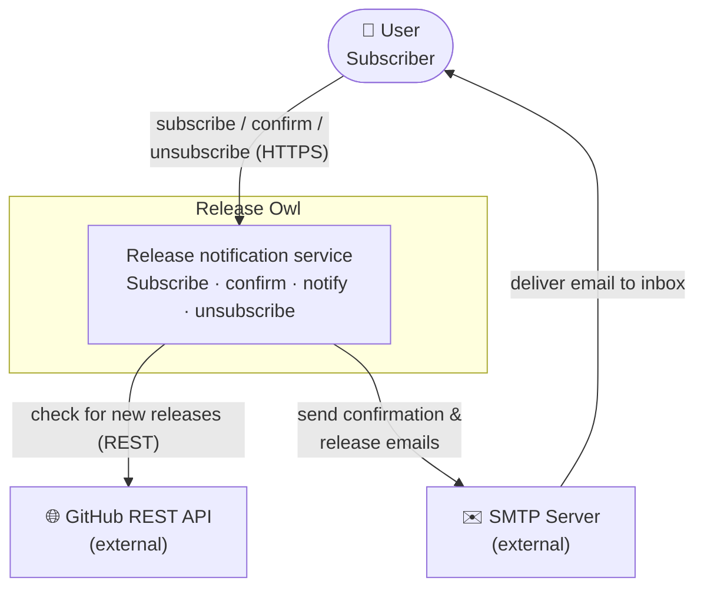
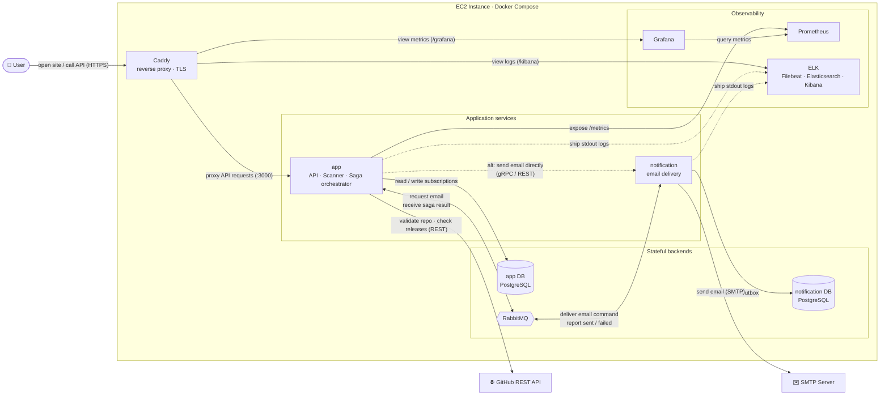

# Architecture: Release Owl

This document describes the high-level architecture of **Release Owl** using the
top two levels of the [C4 model](https://c4model.com/):

- **Level 1 — System Context** — who uses the system and what it talks to.
- **Level 2 — Containers** — the deployable/runtime units and how they communicate.

---

## 1. Level 1 — System Context

Release Owl lets a user subscribe by email to new releases of a GitHub
repository. It polls the GitHub REST API for new release tags and delivers email
via an SMTP server.

**Actors and externals**

| Element         | Type     | Responsibility                                            |
| --------------- | -------- | --------------------------------------------------------- |
| User            | Person   | Subscribes, confirms via double opt-in, unsubscribes      |
| Release Owl     | System   | Core service under design                                 |
| GitHub REST API | External | Source of truth for repository existence and release tags |
| SMTP Server     | External | Outbound email delivery                                   |

---

## 2. Level 2 — Containers

Release Owl runs as two Node.js services behind a Caddy reverse proxy, backed by
a **database-per-service** topology, coordinated over RabbitMQ, and observed by a
Prometheus/Grafana + ELK stack. Everything ships as containers via
`docker-compose.yml`.

**Reading the diagram** — solid arrows `→` are synchronous calls and data ownership;
double arrows `⇔` are the asynchronous broker exchange (default transport); dotted
arrows are secondary paths (the alternative gRPC/REST transport and log shipping).
The three backends are grouped because each is an independent stateful container;
observability is isolated so it doesn't cross the request path.

**Containers**

| Container              | Tech             | Responsibility                                                             | State                |
| ---------------------- | ---------------- | -------------------------------------------------------------------------- | -------------------- |
| **Caddy**              | Caddy            | TLS termination, reverse proxy, path routing to app / Grafana / Kibana     | stateless            |
| **app**                | Node 20, Express | REST API, hourly release scanner (cron), Saga orchestrator, outbox relay   | owns app DB          |
| **notification**       | Node 20          | Consumes email requests, renders templates, delivers via SMTP with retries | owns notification DB |
| **PostgreSQL (app)**   | Postgres 16      | `subscriptions`, `repositories`, `outbox`, `subscription_sagas`            | persistent           |
| **PostgreSQL (notif)** | Postgres 16      | `outbox`, `inbox` (idempotency) for the notification service               | persistent           |
| **RabbitMQ**           | RabbitMQ 3.13    | Async command/reply transport for the Saga                                 | broker               |
| **Prometheus/Grafana** | —                | Metrics scraping + dashboards                                              | monitoring           |
| **Filebeat/ES/Kibana** | ELK              | Centralised structured (JSON) log aggregation and search                   | logging              |

> **Pluggable transport (Ports & Adapters).** The app talks to the notification
> service through a single `Notifier` **port** with three interchangeable
> **adapters**, selected by the `NOTIFIER` env var:
>
> - `broker` _(default)_ — publish `email.requested` to RabbitMQ (async, decoupled, enables the Saga)
> - `grpc` — direct gRPC call (`@release-owl/proto`)
> - `rest` — direct HTTP call
>
> This lets the same business logic swap synchronous vs. asynchronous delivery
> without touching the modules — see [system-design.md](system-design.md).

---

## 3. Key Architectural Decisions

| Decision                                     | Rationale                                                                                     | Reference                                            |
| -------------------------------------------- | --------------------------------------------------------------------------------------------- | ---------------------------------------------------- |
| **Modular monolith + one extracted service** | Clear module boundaries via ports; extract only what benefits from independent scaling/deploy | [system-design.md](system-design.md)                 |
| **Database-per-service**                     | No cross-service DB coupling; each service owns its schema                                    | [data-model.md](data-model.md)                       |
| **Transactional outbox**                     | At-least-once event publishing without 2PC                                                    | [saga.md](saga.md)                                   |
| **Orchestrated Saga**                        | Consistency for the pending subscription; compensates on permanent email failure              | [saga.md](saga.md)                                   |
| **Pluggable Notifier port**                  | Swap broker / gRPC / REST transport without touching business logic                           | this doc §2                                          |
| **Enforced layer boundaries**                | Architecture is an executable contract — forbidden dependencies fail the build                | [architecture-tests.md](architecture-tests.md)       |
| **Caddy reverse proxy**                      | TLS + single ingress for app, Grafana, Kibana                                                 | [ADR-001](adr/ADR-001-caddy-reverse-proxy.md)        |
| **Scanner horizontal scaling**               | Design for scaling the release-polling workload                                               | [ADR-002](adr/ADR-002-scanner-horizontal-scaling.md) |
| **ELK for logging**                          | Centralised structured log search                                                             | [ADR-003](adr/ADR-003-elk-stack-logging.md)          |
