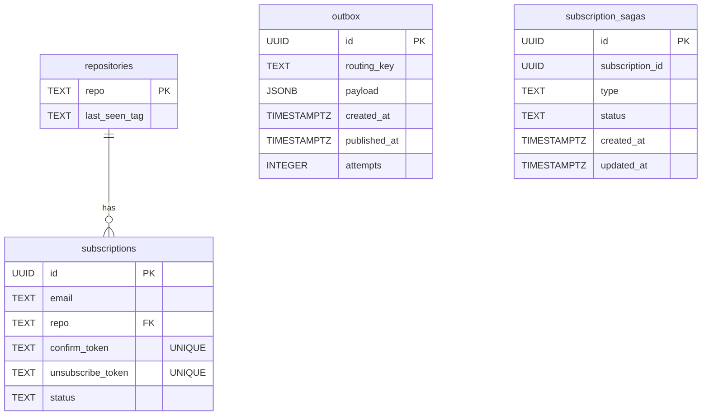

# Data Model

## App Service (PostgreSQL)

```sql
-- Tracked repositories
CREATE TABLE repositories (
  repo          TEXT PRIMARY KEY,   -- 'owner/repo', e.g. 'golang/go'
  last_seen_tag TEXT                -- last known release tag, NULL if never checked
);

-- User subscriptions
CREATE TABLE subscriptions (
  id                UUID PRIMARY KEY DEFAULT gen_random_uuid(),
  email             TEXT NOT NULL,
  repo              TEXT NOT NULL REFERENCES repositories(repo) ON DELETE CASCADE,
  confirm_token     TEXT NOT NULL UNIQUE,      -- hex 64 chars, crypto.randomBytes(32)
  unsubscribe_token TEXT NOT NULL UNIQUE,
  status            TEXT NOT NULL DEFAULT 'pending',  -- 'pending' | 'confirmed'
  UNIQUE (email, repo)
);

-- Transactional outbox for email.requested commands
CREATE TABLE outbox (
  id           UUID PRIMARY KEY DEFAULT gen_random_uuid(),
  routing_key  TEXT        NOT NULL,
  payload      JSONB       NOT NULL,
  created_at   TIMESTAMPTZ NOT NULL DEFAULT now(),
  published_at TIMESTAMPTZ,          -- NULL = not yet published
  attempts     INTEGER     NOT NULL DEFAULT 0
);
CREATE INDEX outbox_unpublished_idx ON outbox (published_at, created_at);

-- Saga state: one row per subscribe→email-delivered transaction
CREATE TABLE subscription_sagas (
  id              UUID PRIMARY KEY DEFAULT gen_random_uuid(),  -- = saga_id / correlation id
  subscription_id UUID NOT NULL,   -- no FK: row outlives the subscription during compensation
  type            TEXT NOT NULL DEFAULT 'subscribe',
  status          TEXT NOT NULL DEFAULT 'started',  -- 'started' | 'completed' | 'compensated'
  created_at      TIMESTAMPTZ NOT NULL DEFAULT now(),
  updated_at      TIMESTAMPTZ NOT NULL DEFAULT now()
);
CREATE INDEX subscription_sagas_status_idx ON subscription_sagas (status);
```

### ER Diagram



### Migrations (`src/platform/db/migrations/`)

Applied automatically via `docker-entrypoint.sh` → `node dist/migrate.js`.

| File                                           | Change                          |
| ---------------------------------------------- | ------------------------------- |
| `001_create_repositories_and_subscriptions.ts` | `repositories`, `subscriptions` |
| `002_create_outbox.ts`                         | `outbox`                        |
| `003_create_subscription_sagas.ts`             | `subscription_sagas`            |

---

## Notification Service (окрема PostgreSQL)

```sql
-- Transactional outbox for saga reply events (email.sent / email.failed)
CREATE TABLE outbox (
  id           UUID PRIMARY KEY DEFAULT gen_random_uuid(),
  routing_key  TEXT        NOT NULL,
  payload      JSONB       NOT NULL,
  created_at   TIMESTAMPTZ NOT NULL DEFAULT now(),
  published_at TIMESTAMPTZ,
  attempts     INTEGER     NOT NULL DEFAULT 0
);
CREATE INDEX outbox_unpublished_idx ON outbox (published_at, created_at);

-- Inbox dedup: exactly-once processing per saga_id
CREATE TABLE inbox (
  id           TEXT PRIMARY KEY,  -- saga_id
  status       TEXT NOT NULL,     -- 'sent' | 'failed'
  processed_at TIMESTAMPTZ NOT NULL DEFAULT now()
);
```

### Migrations (`services/notification/src/db/migrations/`)

Applied via `services/notification/docker-entrypoint.sh` → `node services/notification/dist/migrate.js`.

| File                   | Change                            |
| ---------------------- | --------------------------------- |
| `001_create_outbox.ts` | `outbox` для reply-подій          |
| `002_create_inbox.ts`  | `inbox` для ідемпотентної обробки |
