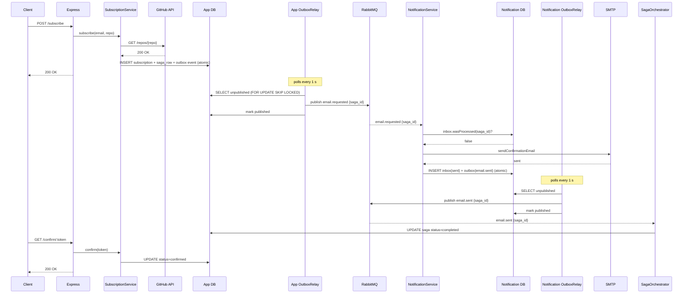
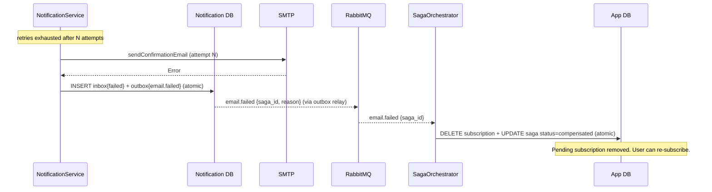

# Orchestrated Saga: subscribe → email delivered

## Overview

The subscribe flow is a distributed transaction across two services:

- **`app`** — orchestrator. Creates the pending subscription and saga state atomically, then waits for a reply.
- **`notification`** — participant. Sends the confirmation email and publishes either `email.sent` or `email.failed`.

**The saga terminates on "email sent."** Clicking the confirmation link is a separate, later step outside the saga.

**Compensation:** if the email cannot be delivered after all retries, `notification` publishes `email.failed` → `app` **deletes the pending subscription** and marks the saga `compensated`. This restores the pre-saga state and frees the `(email, repo)` unique slot so the user can re-subscribe.

---

## Happy Path



---

## Compensation Path (email permanently failed)



---

## App: Orchestrator Components

| Component                      | File                                                  | Role                                                                                              |
| ------------------------------ | ----------------------------------------------------- | ------------------------------------------------------------------------------------------------- |
| `SubscriptionSagaModel`        | `src/modules/sagas/subscription-saga.model.ts`        | CRUD на таблиці `subscription_sagas`                                                              |
| `SubscriptionSagaOrchestrator` | `src/modules/sagas/subscription-saga.orchestrator.ts` | `onEmailSent` → `completed`; `onEmailFailed` → delete subscription + `compensated`                |
| `SagaReplyConsumer`            | `src/modules/sagas/saga-reply.consumer.ts`            | Підписується на `email.sent` (queue `app.email-sent`) і `email.failed` (queue `app.email-failed`) |

**Атомарна стартова транзакція** (`SubscriptionService.subscribe`):

```sql
BEGIN
  INSERT subscriptions          → повертає subscription_id
  INSERT subscription_sagas     → повертає saga_id (correlation id)
  INSERT outbox { email.requested, saga_id }
COMMIT
```

**Idempotency:** orchestrator перевіряє `saga.status` перед кожною дією. Якщо сага вже в термінальному стані (`completed` або `compensated`) — хендлер є no-op. Безпечно при at-least-once redelivery.

---

## Notification: Participant Flow

Файл: `services/notification/src/email-requested.consumer.ts`

Тільки `type: 'confirmation'` бере участь у сазі. `type: 'notification'` (release emails) — fire-and-forget без змін.

```text
1. inbox.wasProcessed(saga_id)?  →  так: ack, return (ідемпотентно)
2. sendConfirmationEmail()       →  RetryingEmailSender (N спроб з backoff)
3a. Успіх:
      BEGIN
        INSERT inbox { saga_id, status='sent' }
        INSERT outbox { email.sent, saga_id }
      COMMIT → ack
3b. Вичерпано ретраї:
      BEGIN
        INSERT inbox { saga_id, status='failed' }
        INSERT outbox { email.failed, saga_id, reason }
      COMMIT → ack  (не nack — провал повідомлено через outbox)
```

**Inbox PK constraint** є останньою лінією захисту від дублікатів: якщо два паралельні delivery пройдуть pre-check одночасно, лише один вставить рядок — інший отримає PK violation → nack → redelivery → побачить `wasProcessed=true` → ack.
