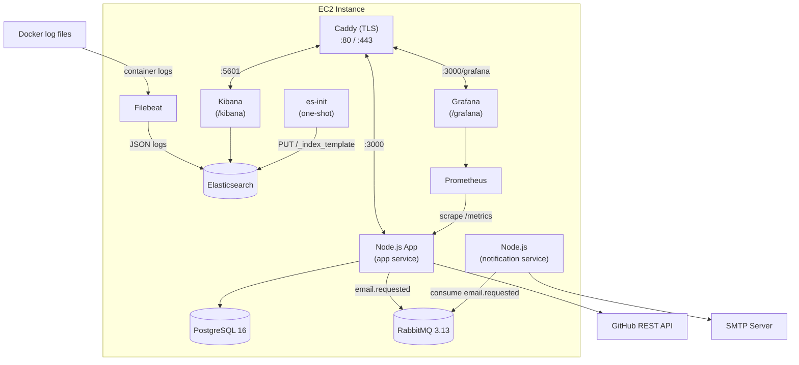
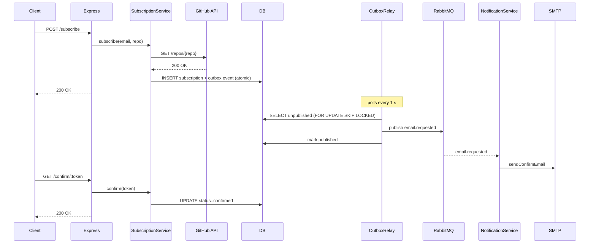
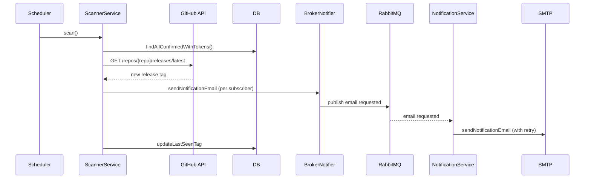
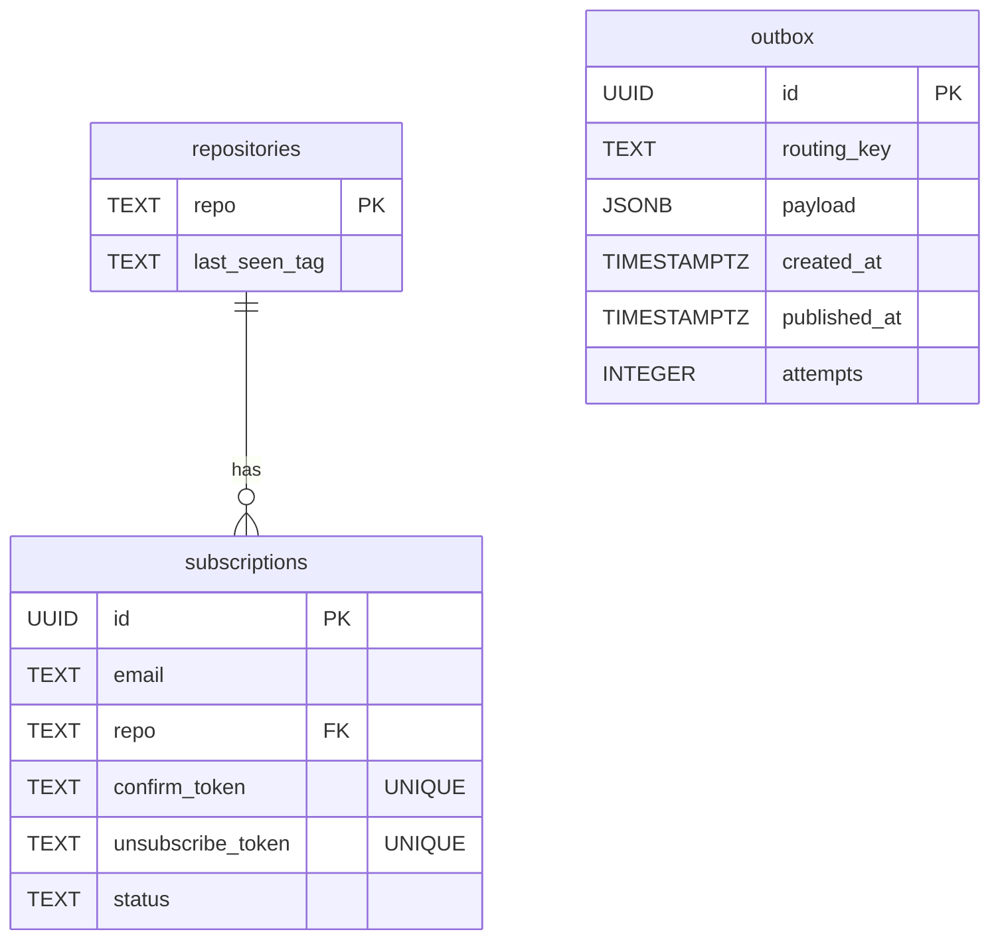
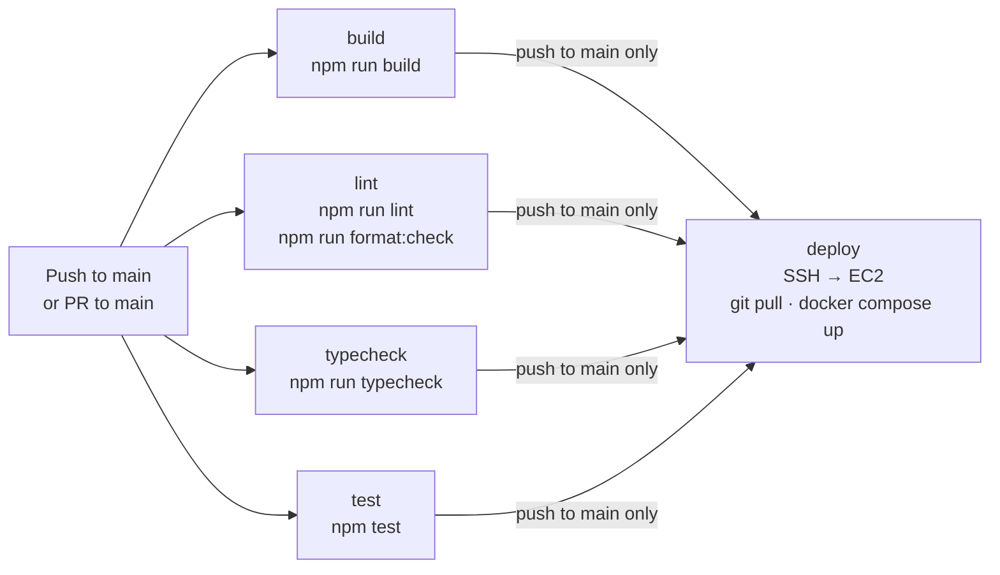

# System Design: Release Owl

## Table of Contents

1. [System Overview](#1-system-overview)
2. [System Requirements](#2-system-requirements)
3. [Constraints](#3-constraints)
4. [Load Estimation](#4-load-estimation)
5. [High-Level Architecture](#5-high-level-architecture)
6. [Detailed Component Design](#6-detailed-component-design)
7. [Data Model](#7-data-model)
8. [API Integration](#8-api-integration)
9. [Observability](#9-observability)
10. [Testing and CI](#10-testing-and-ci)
11. [Future Work](#11-future-work)

---

## 1. System Overview

**Release Owl** is an HTTP service that allows users to subscribe to email notifications about new releases of GitHub repositories. The service periodically polls the GitHub API and sends emails to subscribers when a new release tag is detected.

The system is composed of two runtime services that communicate via a RabbitMQ message broker:

- **`app`** — the main API server and scanner. Handles subscriptions, confirms repositories via GitHub API, persists data, and detects new releases.
- **`notification`** — a standalone microservice that consumes `email.requested` events from RabbitMQ and delivers emails via SMTP.

```mermaid
flowchart TD
    subgraph Sub["Subscription Flow (on demand)"]
        A[User] -->|POST /api/subscribe| B[Repository validation\nGitHub API]
        B --> C[Persist subscription + outbox event\natomic DB transaction]
        C --> D[Outbox relay → RabbitMQ]
        D --> E[Notification service sends confirmation email]
        E --> F[User confirms subscription]
    end

    subgraph Scan["Scanner Flow (scheduled, every hour)"]
        G["[cron] Scheduler"] --> H[Fetch all confirmed subscriptions]
        H --> I[GitHub API — check latest release]
        I -->|new release detected| J[Publish email.requested to RabbitMQ]
        J --> K[Notification service sends release email]
        I -->|no new release| L[Skip]
    end
```



---

## 2. System Requirements

### 2.1 Functional Requirements

| #    | Requirement                                                                                          |
| ---- | ---------------------------------------------------------------------------------------------------- |
| F-01 | A user can subscribe to notifications by providing an email and an `owner/repo` slug                 |
| F-02 | The system validates repository existence via the GitHub REST API before persisting the subscription |
| F-03 | A subscription is activated only after email confirmation (double opt-in)                            |
| F-04 | The system sends a confirmation email with a verification link after a subscription is registered    |
| F-05 | The system sends email notifications to all confirmed subscribers when a new release is detected     |
| F-06 | Every notification email contains an unsubscribe link with a one-time token                          |
| F-07 | A user can unsubscribe at any time by following their unique unsubscribe link                        |
| F-08 | The system exposes an API to list all subscriptions (pending and confirmed) for a given email        |
| F-09 | The `(email, repo)` pair is unique — a duplicate subscription returns 409                            |
| F-10 | A static landing page allows subscribing without calling the API directly                            |
| F-11 | Swagger UI is available at `/api/docs` for interactive API testing                                   |

### 2.2 Non-Functional Requirements

| Category            | Requirement                          | Target                                                             |
| ------------------- | ------------------------------------ | ------------------------------------------------------------------ |
| **Availability**    | Service uptime                       | ≥ 99% (single-instance EC2)                                        |
| **Scalability**     | Number of monitored repositories     | Up to 1,000 without architectural changes                          |
| **Reliability**     | Confirmation email delivery          | Transactional outbox guarantees at-least-once delivery to broker   |
| **Reliability**     | SMTP transient failures              | Notification service retries with exponential backoff (3 attempts) |
| **Reliability**     | Single email send failure            | Does not stop processing other subscribers (`Promise.allSettled`)  |
| **Reliability**     | Scanner crash                        | Does not affect HTTP request handling (graceful logging)           |
| **Reliability**     | Broker connection loss               | `RabbitMQBroker` reconnects automatically (up to 10 retries)       |
| **Security**        | Brute-force protection               | Rate limiting: 100 req / 15 min / IP                               |
| **Security**        | API endpoint protection              | `X-API-Key` with timing-safe comparison (required)                 |
| **Security**        | Transport                            | TLS via Caddy (Let's Encrypt) in production                        |
| **Configurability** | Start without required env variables | Fail-fast on startup                                               |
| **Maintainability** | Structured JSON logging              | Pino, DEBUG/INFO/ERROR levels                                      |
| **Testability**     | Unit + integration test coverage     | Jest + Supertest                                                   |

---

## 3. Constraints

### Technical Constraints

- **GitHub API rate limit without a token:** 60 requests/hour per IP. With N unique repositories on an hourly cron schedule, the system can process at most 60 repos without `GITHUB_TOKEN`. With a token — 5,000 requests/hour.
- **In-process scheduler:** `node-cron` runs in the same Event Loop as the HTTP server. A long scan cycle can delay HTTP request handling with a large number of repositories.
- **No retry mechanism for GitHub requests:** transient GitHub API failures result in a missed notification until the next cron tick.
- **No horizontal scaling:** single process + single DB instance. Running multiple instances will cause duplicate notifications (see [future work](#11-future-work)).
- **At-least-once delivery via outbox:** the outbox relay may re-publish an event if it crashes after publishing but before marking the row as published. The notification service must tolerate duplicate `email.requested` messages.

### Business Constraints

- The service monitors only **public GitHub repositories** (no OAuth for private repos).
- Only **official GitHub releases** (`/releases/latest`) are tracked — not tags or pre-releases.
- Only **one active subscription** per `(email, repo)` pair is supported.

### Infrastructure Constraints

- Deployed on a **single EC2 instance** (no load balancer, no auto-scaling).
- Database — **single-node PostgreSQL** with no replicas and no backup beyond the Docker volume.
- Message broker — **single-node RabbitMQ** with a persistent durable queue.

---

## 4. Load Estimation

### 4.1 Users and Traffic

| Metric                     | Estimate | Note                                       |
| -------------------------- | -------- | ------------------------------------------ |
| Active subscribers         | ~1,000   | MVP target audience                        |
| Unique repositories        | ~300     | Some subscribers follow the same repo      |
| New subscriptions / day    | ~20      | `POST /api/subscribe`                      |
| Confirmations / day        | ~18      | ~90% conversion rate                       |
| Subscription lookups / day | ~10      | `GET /api/subscriptions`                   |
| GitHub API requests / hour | ~300     | 1 request × 300 repos × 1 time/hour        |
| Email notifications / hour | ~50      | ~5% of repos having a new release per hour |

### 4.2 Data

| Table           | Row size (estimate) | Rows                | Volume                     |
| --------------- | ------------------- | ------------------- | -------------------------- |
| `repositories`  | ~100 bytes          | 300                 | ~30 KB                     |
| `subscriptions` | ~300 bytes          | 1,000               | ~300 KB                    |
| `outbox`        | ~500 bytes          | ~20/day (transient) | Rows deleted after publish |

**Growth:** +20 subscriptions/day = 6 KB/day → **2 MB/year**. PostgreSQL thresholds are not a concern at any realistic volume.

### 4.3 Bandwidth

| Direction                    | Estimate          | Calculation                   |
| ---------------------------- | ----------------- | ----------------------------- |
| Inbound HTTP traffic         | ~5 KB/hour        | ~20 req × ~250 bytes/req      |
| Outbound to GitHub API       | ~90 KB/hour       | 300 req × ~300 bytes response |
| Outbound email notifications | ~50 KB/hour       | 50 emails × ~1 KB/email       |
| **Total**                    | **< 200 KB/hour** | Not a bottleneck              |

---

## 5. High-Level Architecture



### Subscription Flow (Happy Path)



### Scanner Flow (Release Notification)



---

## 6. Detailed Component Design

### 6.1 HTTP Server (Express 5)

**Middleware pipeline** (in execution order):

```
express.static(public/)        → static landing page
helmet()                        → security headers
cors({ origin, methods })       → CORS allowlist
rateLimit(100/15min/IP)         → brute-force protection
pinoHttp()                      → structured request logging
express.json()                  → JSON body parsing
express.urlencoded()            → form body parsing
swagger-ui (/api/docs)          → OpenAPI documentation
subscriptionRoutes (/api)       → business endpoints
errorHandler()                  → centralized error handling
```

**Error handling:**

- `ZodError` → 400 Bad Request with validation details
- `AppError` (custom: `RepositoryNotFoundError`, `DuplicateSubscriptionError`, `InvalidTokenError`, `TokenNotFoundError`) → corresponding HTTP status codes
- Unexpected errors → 500 Internal Server Error (no stack trace leaked)

### 6.2 Subscription Service

Coordinates the full subscription lifecycle:

| Method                    | Action                                                                                                                                           |
| ------------------------- | ------------------------------------------------------------------------------------------------------------------------------------------------ |
| `subscribe(email, repo)`  | Validates repo → checks for duplicate → generates tokens (`crypto.randomBytes(32)`) → persists subscription + outbox event in one DB transaction |
| `confirm(token)`          | Validates token format (hex 64) → updates status to `confirmed`                                                                                  |
| `unsubscribe(token)`      | Validates format → deletes the subscription row                                                                                                  |
| `getSubscriptions(email)` | Returns all subscriptions for the given email                                                                                                    |

**Key detail:** the subscription row and the `email.requested` outbox event are written in a single transaction. The outbox relay later publishes the event to RabbitMQ, decoupling the HTTP response from broker availability and preventing lost confirmation emails even if the broker is temporarily down.

### 6.3 Scanner Service

Cron job with a configurable schedule (`SCANNER_CRON_SCHEDULE`, default: `0 * * * *`):

1. Loads all `confirmed` subscriptions with `last_seen_tag` in a single query
2. Groups subscriptions by `repo` → 1 GitHub API call per repository regardless of subscriber count
3. Compares `release.tag_name` against `last_seen_tag`
4. On a new release: delegates to `InProcessReleaseHandler`
5. `InProcessReleaseHandler` publishes `email.requested` events to RabbitMQ via `BrokerNotifier` for each subscriber using `Promise.allSettled` (one failure does not stop the rest)
6. Updates `last_seen_tag` in the `repositories` table (only after all publishes succeed)

**Key detail:** using `Promise.allSettled` instead of `Promise.all` ensures that a broker failure for one subscriber does not interrupt notifications to others.

### 6.4 Outbox Relay

Implements the [transactional outbox pattern](https://microservices.io/patterns/data/transactional-outbox.html) for confirmation emails:

- Polls the `outbox` table every `OUTBOX_POLL_INTERVAL_MS` (default: 1,000 ms)
- Claims unpublished rows in batches of `OUTBOX_BATCH_SIZE` (default: 50) using `SELECT … FOR UPDATE SKIP LOCKED` — safe for multiple concurrent relay instances
- Publishes each row to the broker, then marks the batch as published — all inside one transaction (at-least-once delivery)
- Skips a poll cycle if the previous drain is still running

### 6.5 Message Broker (`RabbitMQBroker`)

Topic exchange `release-owl.events`. All events are persistent (survive broker restart):

| Event routing key | Producer                       | Consumer               | Queue                          |
| ----------------- | ------------------------------ | ---------------------- | ------------------------------ |
| `email.requested` | `app` (outbox relay / scanner) | `notification` service | `notification.email-requested` |

`RabbitMQBroker` (in `@release-owl/platform`) handles connection retries with exponential backoff (up to 10 attempts, capped at 30 s) and automatic reconnection on connection loss.

### 6.6 GitHub Service

Thin wrapper around GitHub REST API v2022-11-28:

| Method                   | Endpoint                                    | Behavior                                                                        |
| ------------------------ | ------------------------------------------- | ------------------------------------------------------------------------------- |
| `repositoryExists(repo)` | `GET /repos/{owner}/{repo}`                 | `200` → true, `404` → false, `429`/`403` → throw `GitHubRateLimitError`         |
| `getLatestRelease(repo)` | `GET /repos/{owner}/{repo}/releases/latest` | `200` → `{tag_name, html_url}`, `404` → null (no releases), `429`/`403` → throw |

**Rate limit handling:** both primary and secondary rate limits can return either `403` or `429`. The `handleRateLimit` method determines `resetAt` using the following priority (per GitHub docs):

1. `Retry-After` header (seconds) — present on secondary rate limit responses; takes priority.
2. `X-RateLimit-Reset` header (Unix seconds) — present when the primary rate limit is exhausted.
3. Fallback: `now + 60 s`.

Without `GITHUB_TOKEN` — 60 req/hour; with token — 5,000 req/hour.

### 6.7 Notification Service

Standalone Node.js process (`services/notification`). Responsibilities:

| Component                | Role                                                                                |
| ------------------------ | ----------------------------------------------------------------------------------- |
| `EmailRequestedConsumer` | Subscribes to `email.requested` on RabbitMQ; dispatches to email sender             |
| `RetryingEmailSender`    | Wraps Nodemailer; retries transient SMTP failures with exponential backoff          |
| `EmailTemplateBuilder`   | Renders confirmation and notification email HTML                                    |
| Health server            | Minimal HTTP server on `:3002` — returns `{"status":"ok"}` for Docker health checks |

Email types:

| Type         | Subject                     | Content                                                              |
| ------------ | --------------------------- | -------------------------------------------------------------------- |
| Confirmation | `Confirm your subscription` | Link `{BASE_URL}/api/confirm/{token}`                                |
| Notification | `New release: {repo} {tag}` | Release link + unsubscribe link `{BASE_URL}/api/unsubscribe/{token}` |

SMTP retry policy: up to `EMAIL_RETRY_ATTEMPTS` (default: 3) attempts with initial backoff `EMAIL_RETRY_BACKOFF_MS` (default: 500 ms), doubling on each failure.

### 6.8 Config Module

**`app` service** — fail-fast validation on startup:

```env
DATABASE_URL              → required
RABBITMQ_URL              → optional (default: amqp://localhost:5672)
API_KEY                   → required (enables X-API-Key auth)
GITHUB_TOKEN              → optional (increases rate limit to 5,000/hour)
BASE_URL                  → optional (default: http://localhost:3000)
ALLOWED_ORIGIN            → optional (default: '*')
PORT                      → optional (default: 3000)
SCANNER_CRON_SCHEDULE     → optional (default: '0 * * * *')
OUTBOX_POLL_INTERVAL_MS   → optional (default: 1000)
OUTBOX_BATCH_SIZE         → optional (default: 50)
```

**`notification` service** — fail-fast validation on startup:

```env
RABBITMQ_URL              → optional (default: amqp://localhost:5672)
SMTP_HOST                 → required
SMTP_PORT                 → optional (default: 587)
SMTP_USER                 → required
SMTP_PASS                 → required
SMTP_FROM                 → required
BASE_URL                  → optional (default: http://localhost:3000)
EMAIL_RETRY_ATTEMPTS      → optional (default: 3)
EMAIL_RETRY_BACKOFF_MS    → optional (default: 500)
HEALTH_PORT               → optional (default: 3002)
```

---

## 7. Data Model

### Database Schema

```sql
-- Tracked repositories
CREATE TABLE repositories (
  repo          TEXT PRIMARY KEY,        -- 'owner/repo', e.g. 'golang/go'
  last_seen_tag TEXT                     -- last known release tag, NULL if never checked
);

-- User subscriptions
CREATE TABLE subscriptions (
  id                UUID PRIMARY KEY DEFAULT gen_random_uuid(),
  email             TEXT NOT NULL,
  repo              TEXT NOT NULL REFERENCES repositories(repo) ON DELETE CASCADE,
  confirm_token     TEXT NOT NULL UNIQUE,      -- hex 64 chars, crypto.randomBytes(32)
  unsubscribe_token TEXT NOT NULL UNIQUE,      -- hex 64 chars, crypto.randomBytes(32)
  status            TEXT NOT NULL DEFAULT 'pending',  -- 'pending' | 'confirmed'

  UNIQUE (email, repo)
);

-- Transactional outbox for broker events
CREATE TABLE outbox (
  id          UUID PRIMARY KEY DEFAULT gen_random_uuid(),
  routing_key TEXT        NOT NULL,
  payload     JSONB       NOT NULL,
  created_at  TIMESTAMPTZ NOT NULL DEFAULT now(),
  published_at TIMESTAMPTZ,                   -- NULL = not yet published
  attempts    INTEGER     NOT NULL DEFAULT 0
);
-- Index used by the relay to find unpublished rows oldest-first
CREATE INDEX outbox_unpublished_idx ON outbox (published_at, created_at);
```

### ER Diagram



### Migrations

Managed via Knex migrations (`src/platform/db/migrations/`). Applied automatically on container start via `docker-entrypoint.sh`:

```sh
node dist/migrate.js   # knex migrate:latest
node dist/index.js     # start the service
```

| Migration file                                 | Change                                            |
| ---------------------------------------------- | ------------------------------------------------- |
| `001_create_repositories_and_subscriptions.ts` | Creates `repositories` and `subscriptions` tables |
| `002_create_outbox.ts`                         | Creates `outbox` table with relay index           |

---

## 8. API Integration

### 8.1 REST API Reference

**Base URL:** `/api`  
**Content-Type:** `application/json` or `application/x-www-form-urlencoded`  
**Auth:** `X-API-Key: <key>` (`API_KEY` is required)

---

#### `POST /api/subscribe`

Subscribe to release notifications for a repository.

**Request:**

```json
{ "email": "user@example.com", "repo": "golang/go" }
```

**Responses:**

| Status             | Description                                         |
| ------------------ | --------------------------------------------------- |
| `200 OK`           | Subscription created, confirmation email queued     |
| `400 Bad Request`  | Invalid email or repo format                        |
| `401 Unauthorized` | Missing or invalid API key                          |
| `404 Not Found`    | Repository not found on GitHub                      |
| `409 Conflict`     | This email is already subscribed to this repository |

---

#### `GET /api/confirm/:token`

Confirm a subscription using the token from the confirmation email.

**Path param:** `token` — 64-character hex string

**Responses:**

| Status            | Description            |
| ----------------- | ---------------------- |
| `200 OK`          | Subscription confirmed |
| `400 Bad Request` | Invalid token format   |
| `404 Not Found`   | Token not found        |

> **Note on HTTP semantics:** RFC 9110 requires `GET` to be safe and idempotent (no state mutation). This endpoint intentionally violates that constraint because confirmation links are opened directly by the browser from an email — there is no opportunity to use `POST` without serving an intermediate HTML page. The trade-off is accepted for simplicity at the MVP stage. A stricter alternative would be: `GET /api/confirm/:token` renders an HTML page with a "Confirm" button, which submits `POST /api/confirm/:token` to perform the actual state change.

---

#### `GET /api/unsubscribe/:token`

Unsubscribe using the token from a notification email.

**Path param:** `token` — 64-character hex string

**Responses:**

| Status            | Description               |
| ----------------- | ------------------------- |
| `200 OK`          | Successfully unsubscribed |
| `400 Bad Request` | Invalid token format      |
| `404 Not Found`   | Token not found           |

> **Note on HTTP semantics:** same trade-off as `GET /api/confirm/:token` above — the unsubscribe link is embedded in notification emails and must work with a single browser `GET`. A fully RFC-compliant design would serve an HTML confirmation page first and perform the deletion via `POST`.

---

#### `GET /api/subscriptions?email=...`

Get all active subscriptions for an email address.

**Query param:** `email` — email address

**Response `200`:**

```json
[
  {
    "email": "user@example.com",
    "repo": "golang/go",
    "confirmed": true,
    "last_seen_tag": "go1.22.0"
  }
]
```

---

### 8.2 GitHub REST API Integration

| Purpose                    | Endpoint                                                      | Method |
| -------------------------- | ------------------------------------------------------------- | ------ |
| Check repository existence | `https://api.github.com/repos/{owner}/{repo}`                 | GET    |
| Get latest release         | `https://api.github.com/repos/{owner}/{repo}/releases/latest` | GET    |

**Headers:**

```
Accept: application/vnd.github+json
X-GitHub-Api-Version: 2022-11-28
Authorization: Bearer {GITHUB_TOKEN}   (optional)
```

**Rate limits:**

| Mode                | Limit                |
| ------------------- | -------------------- |
| Without token       | 60 req/hour (per IP) |
| With `GITHUB_TOKEN` | 5,000 req/hour       |

When the rate limit is exceeded (status 429), the service throws `GitHubRateLimitError` and logs the reset time from `X-RateLimit-Reset`.

### 8.3 RabbitMQ Event Contract

**Exchange:** `release-owl.events` (topic, durable)

#### `email.requested`

Published by the `app` service (via outbox relay for confirmations; directly for release notifications). Consumed by the `notification` service from queue `notification.email-requested` (durable).

**Payload** (discriminated union on `type`):

```typescript
// Confirmation email
{
  type: "confirmation",
  email: string,
  repo: string,
  confirm_token: string
}

// Release notification email
{
  type: "notification",
  email: string,
  repo: string,
  tag_name: string,
  unsubscribe_token: string
}
```

Contracts are defined in the shared `@release-owl/contracts` package (`packages/contracts`).

### 8.4 SMTP Integration

Nodemailer over standard SMTP. Used only by the `notification` service. Compatible with any SMTP provider:

| Provider | SMTP_HOST          | SMTP_PORT |
| -------- | ------------------ | --------- |
| Gmail    | `smtp.gmail.com`   | `587`     |
| Resend   | `smtp.resend.com`  | `465`     |
| Mailgun  | `smtp.mailgun.org` | `587`     |

---

## 9. Observability

### 9.1 Logging (current)

Structured JSON logging is implemented via **Pino** with `pino-http` for HTTP request logging. Logs are aggregated via the **ELK stack** (see [ADR-003](adr/ADR-003-elk-stack-logging.md)).

| Level   | When used                                                               |
| ------- | ----------------------------------------------------------------------- |
| `DEBUG` | Verbose internal details (disabled in production)                       |
| `INFO`  | Successful operations: subscription created, email sent, scan completed |
| `ERROR` | Failures: GitHub API errors, SMTP errors, unexpected exceptions         |

Every HTTP request is logged with method, URL, status code, and response time. The scanner logs each cycle: repositories checked, new releases found, emails sent. The outbox relay logs each drain cycle and any publish failures.

**Log pipeline:**

```text
Node.js (Pino JSON) → Docker log driver → Filebeat → Elasticsearch → Kibana
```

Filebeat reads container logs via the Docker socket and uses the `co.elastic.logs/*` labels on the `app` and `notification` containers to parse output as JSON. In production, Kibana is available at `https://<DOMAIN>/kibana` behind Caddy `basic_auth`.

**Index template (`es-init`):**

An `es-init` one-shot container (`curlimages/curl`) runs on every `docker compose up`, after Elasticsearch passes its health check. It applies the composable index template from `elasticsearch/index-template.json` via `PUT /_index_template/app-logs`. A `dynamic_template` maps any unmapped string field to `keyword` by default, preventing Elasticsearch from auto-guessing `text` for new fields.

### 9.2 Metrics (current)

Metrics are exposed at `GET /metrics` in Prometheus exposition format via **prom-client**. The endpoint is blocked externally by Caddy (`respond 404`) — only Prometheus scrapes it internally over the Docker network every 15 s.

**Metric pipeline:**

```
Node.js (prom-client) → GET /metrics → Prometheus (scrape) → Grafana (visualise)
```

**Grafana** is available at `https://<DOMAIN>/grafana` behind Caddy `basic_auth`. On startup it auto-provisions Prometheus as the default datasource and loads the pre-built dashboard from `grafana/dashboards/github-scanner.json`.

| Metric                            | Type      | Labels                     | Description                              |
| --------------------------------- | --------- | -------------------------- | ---------------------------------------- |
| `http_requests_total`             | Counter   | method, route, status_code | Total HTTP requests                      |
| `http_request_duration_seconds`   | Histogram | method, route, status_code | Request latency — P50/P95/P99            |
| `github_api_requests_total`       | Counter   | operation, result          | GitHub API calls by operation and result |
| `subscription_operations_total`   | Counter   | operation, result          | Subscribe/confirm/unsubscribe outcomes   |
| `scanner_releases_detected_total` | Counter   | repo                       | New releases found per repository        |
| `scanner_emails_sent_total`       | Counter   | repo                       | Notification emails sent per repository  |
| `scanner_scan_duration_seconds`   | Histogram | result                     | Full scanner cycle duration              |

Default Node.js runtime metrics (CPU, heap, RSS, event-loop lag) are also collected via `collectDefaultMetrics()`.

### 9.3 Alerting (planned)

> Not yet implemented.

| Alert             | Condition                                        |
| ----------------- | ------------------------------------------------ |
| Service down      | No successful HTTP responses for > 2 min         |
| Scanner stalled   | No scan cycle completed within 2× cron interval  |
| GitHub rate limit | `github_api_errors_total{type="rate_limit"}` > 0 |
| High error rate   | HTTP 5xx rate > 1% over 5 min                    |

---

## 10. Testing and CI

### 10.1 Test Strategy

The project uses **Jest** as the test runner with **Supertest** for HTTP-layer integration tests.

| Layer       | Tool             | Scope                                                         |
| ----------- | ---------------- | ------------------------------------------------------------- |
| Unit        | Jest             | Individual service and middleware functions in isolation      |
| Integration | Jest + Supertest | Full HTTP request/response cycle against a real test database |

**Unit tests** (`src/**/__tests__/`, `services/**/__tests__/`) mock all external dependencies (database, GitHub API, broker) and verify business logic in isolation:

| File                                                                   | What is tested                                                             |
| ---------------------------------------------------------------------- | -------------------------------------------------------------------------- |
| `src/modules/subscriptions/__tests__/subscription.service.test.ts`     | Subscribe, confirm, unsubscribe, duplicate detection, outbox enqueue       |
| `src/modules/releases/__tests__/scanner.service.test.ts`               | Scan cycle: grouping by repo, new release detection, notification dispatch |
| `src/modules/releases/__tests__/release.handler.test.ts`               | Release handling, `Promise.allSettled` failure isolation, tag update       |
| `src/modules/github/__tests__/github.service.test.ts`                  | Repository existence check, latest release fetch, rate limit handling      |
| `src/modules/notifications/__tests__/broker-notifier.test.ts`          | Broker publish calls for confirmation and notification events              |
| `src/modules/outbox/__tests__/outbox.relay.test.ts`                    | Outbox drain batching, at-least-once publish, concurrent drain skip        |
| `src/modules/subscriptions/__tests__/subscription.controller.test.ts`  | Request validation, error mapping to HTTP status codes                     |
| `src/platform/http/__tests__/api-key-auth.test.ts`                     | Timing-safe API key comparison, missing/invalid key rejection              |
| `packages/platform/src/broker/__tests__/rabbitmq.broker.test.ts`       | RabbitMQ publish, subscribe, reconnect, dead-letter on handler failure     |
| `services/notification/src/__tests__/email-requested.consumer.test.ts` | Consumer dispatch for confirmation/notification types                      |
| `services/notification/src/__tests__/retrying-email.sender.test.ts`    | Retry logic with exponential backoff, exhaustion behaviour                 |

**Integration tests** (`tests/integration/subscription.test.ts`) spin up the full Express application and verify end-to-end HTTP flows: subscribe → confirm → receive notification → unsubscribe. All external dependencies (broker, SMTP) are replaced with in-memory fakes, so the full suite runs without any external services.

### 10.2 CI Pipeline

Implemented in `.github/workflows/ci.yml` using GitHub Actions.



All four check jobs run in **parallel** on every push to `main` and every PR targeting `main`.

| Job         | Steps                                                                                              |
| ----------- | -------------------------------------------------------------------------------------------------- |
| `build`     | `npm ci` → `npm run build` — verifies the TypeScript compiles without emit errors                  |
| `lint`      | `npm ci` → `npm run lint` → `npm run format:check` — ESLint + Prettier                             |
| `typecheck` | `npm ci` → `npm run typecheck` — `tsc --noEmit` for type errors without full compilation           |
| `test`      | `npm ci` → `npm test` — full Jest suite (no external services required)                            |
| `deploy`    | SSH into EC2 → `git pull` → `docker compose --profile production up -d --build` → prune old images |

The `deploy` job runs **only on a push to `main`** (i.e. after a PR is merged) and requires all four jobs above to pass first. It never runs on PR events. Required repository secrets: `EC2_HOST`, `EC2_USER`, `EC2_SSH_KEY`, `EC2_WORK_DIR`.

---

## 11. Future Work

Architectural decisions deferred until the project scales beyond a single EC2 instance are tracked as ADRs:

- [ADR-002: Scanner Deduplication Under Horizontal Scaling](adr/ADR-002-scanner-horizontal-scaling.md)
- [ADR-003: ELK Stack for Log Aggregation](adr/ADR-003-elk-stack-logging.md)
